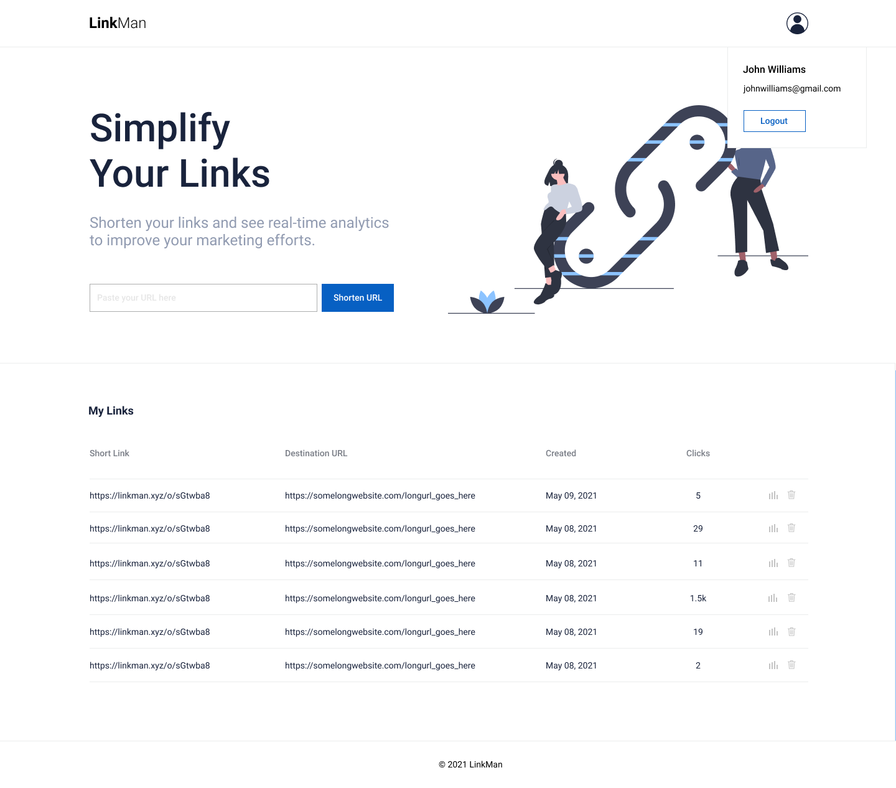

Scenario: Allow logged-in users to manage links they create, and be able to generate vanity urls.

Description: Right now both types of users (anonymous and logged-in) can generate links with random slugs. We'd like to incentivize users to sign up for accounts by allowing them to list the urls they create while logged-in (so there needs to be some association between those urls and the user account) and be able to create "vanity urls" (i.e. custom urls that are not random strings).

That means there will be two (not too different) layouts whether a user is logged-in or not.

The current layout is when a user isn't logged-in and stays as is, except for the "Most Recent Links" and "Most Visited Links" section section where it will only show "public" links (links that were not generated while a user is logged in).

When a user logs in however, creating a new shortened link will associate that link with the user.

The most recent and most visited section on the home page will then be replaced by all the links that a user has generated while logged in, and they will be able delete a shortened link from there.

These "private" links are also hidden from the top links section when viewing the homepage as a non-logged-in user.

Deleting a link does not actually remove the shortened link from the database; rather it just disassociates the link from the user's records, effectively making the link "public" again and enabling it to participate in the topi links leaderboard.

Optionally, a normal link can be turned into a vanity link by first generating a link as usual, then allowing the user to edit the slug. Ideally a user should only be able to convert a normal link to a vanity link three times in a month, but this is optional. We don't have a set design for the vanity url, so we'd like you to try and make a prototype which we can iterate on.
