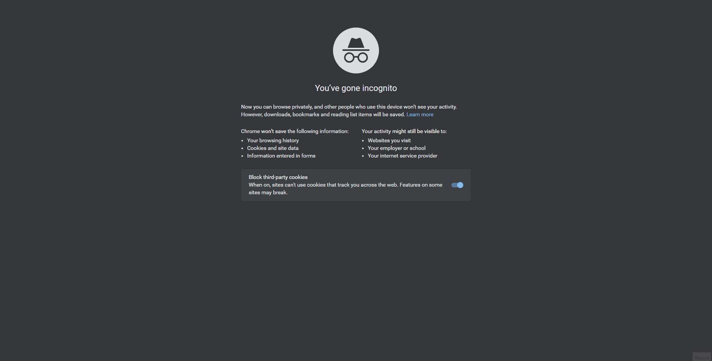

Scenario: The home page is a bit slow at loading the list of most visited urls box.

Description: We'd like to improve the speed at which the list of the most visited urls box loads. A few months ago during launch, it was quite snappy but as time went by it went progressively slower. We would want to have the speed at least match the list of most recent urls box performance.

That said, we're not implying that the list of most recent urls has great performance; we fear the same issue might happen once we get more urls being shortened, so we'd like to get this addressed as early as possible too. The primary goal is the performance of the list of the most visited urls box, however.

